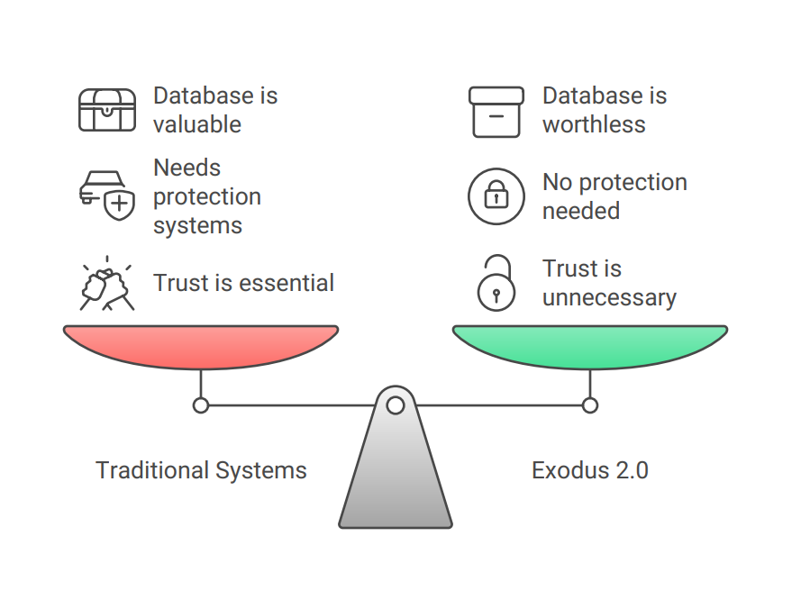

<kbd></kbd>

    
    
   
   
   
   
   
   
   
    
    
   <i>Digital Societal innovation</i>

# Exodus 2.0 Documentation

Welcome to the official documentation repository for Exodus 2.0, a digital social innovation for decentralized trust networks.

## Table of Contents:

- [Overview](#what-is-exodus)
- [Repository Structure](#repository-structure)
- [Core documents](#1-core-documents)
- [Technical documentation](#2-technical-documentation)
- [Implementation](#3-implementation)
- [Research & Theory](#4-research-and-theory)
- [Additional Materials](#5-additional-materials)
- [Reference Materials](#reference-materials)
- [Contributing](#contributing)
- [Code of Conduct](#code-of-conduct)
- [License](#license)
   
## What is Exodus

Imagine a social network where people help each other directly, without needing a big company in the middle. That's DSI Exodus 2.0. It's a decentralized, peer-to-peer (P2P) network built on the idea of mutual aid and cooperation among people who already trust each other, like friends and family. Think of it as a "smart notebook" that helps you keep track of who needs help, who offers it, and who fulfills their promises.   

<kbd></kbd>

## Why do we need it

Exodus 2.0 is designed to solve some big problems:
- No more trust issues: Unlike many systems where you worry about fraud, Exodus 2.0 is built so that harm is virtually impossible. It doesn't handle money directly, and all contributions are voluntary, so you don't have to constantly "verify" if someone is trustworthy in the traditional sense. The system's design makes it reliable by default.   
- Easy mutual support: It helps people formalize their existing connections to create a wider network of support. If you need help, you can request it, and others in your network can offer assistance.   
- Zero transaction costs: It aims to create new ways of cooperating where the costs of transactions are almost zero.   
- Build a strong reputation: By helping others and fulfilling your commitments, you build a visible reputation within the network. This reputation helps you get support when you need it.   
- Community-driven: It's a self-organizing system where the community manages itself, reducing the need for central control.   

<kbd></kbd>

## Repository Structure

- `docs/1_Core_Documents/` - Foundation and overview materials
- `docs/2_Technical_Documentation/` - Technical specifications and architecture
- `docs/3_Implementation/` - Implementation guides and practical materials
- `docs/4_Research_Theory/` - Academic research and theoretical foundation
- `docs/5_Additional_Materials/` - Supporting context and perspectives
- `docs/Reference/` - Glossaries and reference materials
- `Images/` - Innovation visual media
- `vid/` - Videos about innovation
- `src/` - Developed code
- `Law of р2р Trust-free cooperation.docx` - Scientific explanations, proofs and necessary base.

## Quick Start

1. Begin with Core Documents to understand the basic concepts
2. Move to Technical Documentation for system architecture
3. Refer to Implementation guides for practical application
4. Explore Research & Theory for deeper understanding
 
## 1 Core Documents 
   
Essential materials defining Exodus 2.0's vision, mechanisms, and features.
### Contents
1. `1.1_Vision_and_Overview.pdf`
   *   Core concept introduction
   *   System objectives
   *   Key principles
2. `1.2_Core_Mechanisms.pdf`
   *   Fundamental processes
   *   System architecture
   *   Operational principles
3. `1.3_Unique_Features.pdf`
   *   Distinguishing characteristics
   *   Comparative advantages
   *   Innovation aspects
4. `1.4_Current_Status.pdf`
   *   Development stage
   *   Implementation progress
   *   Future roadmap
5. `1.5_Trust_Irrelevance_and_Simplicity.md`
   *   Outlines Exodus 2.0 individual use cases
   *   System records obligations, not transactions
   *   Trust irrelevant, simple, secure design
6. `1.6_Unique_Features.pdf`
   *   Fundamental unique aspects of Exodus 2.0
   *   Contrasts Exodus 2.0 with other decentralized systems
   *   Core philosophy of social interaction over technology
     
## 2 Technical Documentation

Detailed technical specifications and architectural documentation for DSI Exodus 2.0.
This section is vital for developers and architects. It delves into the underlying structure and technical design of Exodus 2.0, explaining how its unique "trust-irrelevant" and self-organizing properties are implemented at a technical level.
### Contents

1.  `2.1_Technical_Specification.md` and `2.1_Technical_Specification.pdf`
    *   System requirements
    *   API documentation (if applicable)
    *   Implementation details
2.  `2.2_Network_Architecture.pdf`
    *   Network topology
    *   Connection protocols
    *   System components
3.  `2.3_Reference_Registry_Guide.pdf`
    *   Registry structure
    *   Data organization
    *   Access protocols

## 3 Implementation
   
Practical guides and integration materials for deploying and interacting with DSI Exodus 2.0.
This section provides hands-on information for developers looking to set up, configure, and integrate with Exodus 2.0. It covers the practical aspects of bringing the theoretical framework to life.
### Contents
1.  `3.1_Implementation_Guide.pdf`
    *   Step-by-step setup
    *   Configuration guidelines
    *   Best practices
2.  `3.2_Interface_and_AI.md`
    *   Minimal interface, AI assistance.
    *   AI for monitoring, matching.
    *   User control, privacy, efficiency.
3.  `3.3_Use_Cases.md`
    *   Real-world applications
    *   Implementation examples
    *   Success stories
      
## 4 Research and Theory

The academic foundation and theoretical framework underpinning DSI Exodus 2.0.
This section is for developers and researchers interested in the profound mathematical and sociological principles that guarantee Exodus 2.0's unique properties, such as its "trust irrelevance" and "autocatalytic" growth. Understanding these theories provides deep insight into the system's inherent robustness and inevitability.
### Contents
1.  `4.1_Mathematical_Foundation.pdf`
    *   Mathematical proofs (e.g., for inevitable network growth, trust irrelevance) [1, 1]
    *   Network growth models (e.g., $N(l)=k^{\wedge}l$) [1, 1]
    *   Theoretical validations
2.  `4.2_Trust_Paradox.pdf`
    *   Exploration of why traditional trust mechanisms are obsolete in Exodus 2.0 [1, 1]
    *   System security implications
    *   Theoretical implications of "trust irrelevance" [1, 1]
3.  `4.3_Network_Growth_Theory.pdf`
    *   Detailed analysis of network growth patterns and scaling principles [1]
    *   Network dynamics and the "friend of my friend" principle [1]

## 5 Additional Materials
   
Contextual and supplementary information about DSI Exodus 2.0.
This section provides broader context for Exodus 2.0, exploring its historical, philosophical, and cultural underpinnings. While not directly technical, these materials offer valuable insights into the project's vision for societal transformation, which can inspire and guide contributors.
### Contents
1.  `5.1_Historical_Context.pdf`
    *   Historical background of mutual aid systems
    *   Comparison with similar systems
    *   Evolution of the Exodus 2.0 concept
2.  `5.2_Philosophical_Background.pdf`
    *   Philosophical foundations
    *   Conceptual framework
    *   Ethical considerations

## Reference Materials

   Glossaries and comprehensive reference documents for DSI Exodus 2.0.
This section provides essential reference materials to clarify terminology and offer comprehensive overviews, ensuring all contributors and users have a shared understanding of Exodus 2.0's unique concepts.
### Contents
1.  `Glossary.pdf`
    *   English terminology
    *   Concept definitions
    *   Technical terms
2.  `Full_Presentation.pdf`
    *   Complete system overview
    *   Visual representations
    *   Comprehensive explanations

   ## Contributing

First, thank you for considering contributing to Exodus. We value contributions of any size or type from anyone! The smallest of fixes can make the biggest difference. Please dive in. Feel free to ask questions on the 5061197@gmail.com email, open an issue, or send a pull request on GitHub.
We follow an agile development process. If you run into a bug or have a problem, the best action is to open an issue on GitHub (please search for related closed issues first).
If you're interested in helping out with the development cycle, feel free to tackle open issues. If you see something you'd like to help with, reach out to us on 5061197@gmail.com to coordinate.

   ## Code of Conduct
      
Be excellent to each other; we’re a community after all. If you run into issues with others in our community, please contact a Exodus Community Dev, or Moderator.
   ### Purpose
   The Exodus Community includes members of varying skills, languages, personalities, cultural backgrounds, and experiences from around the globe. Through these differences, we continue to grow and collectively improve upon an open-source animation engine. When working in a community, it is important to remember that you are interacting with humans on the other end of your screen. This code of conduct will guide your interactions and keep Exodus a positive environment for our developers, users, and fundamentally our growing community.
   ### Our Community
   Members of Exodus Community are respectful, open, and considerate. Behaviors that reinforce these values contribute to our positive environment, and include:
Being respectful. Respectful of others, their positions, experiences, viewpoints, skills, commitments, time, and efforts.
Being open. Open to collaboration, whether it’s on problems, Pull Requests, issues, or otherwise.
Being considerate. Considerate of their peers – other Exodus users and developers.
Focusing on what is best for the community. We’re respectful of the processes set forth in the community, and we work within them.
Showing empathy towards other community members. We’re attentive in our communications, whether in person or online, and we’re tactful when approaching differing views.
Gracefully accepting constructive criticism. When we disagree, we are courteous in raising our issues.
Using welcoming and inclusive language. We’re accepting of all who wish to take part in our activities, fostering an environment where anyone can participate and everyone can make a difference.
   ### Our Standards
   Every member of our community has the right to have their identity respected. Exodus Community is dedicated to providing a positive environment for everyone, regardless of age, gender identity and expression, sexual orientation, disability, physical appearance, body size, ethnicity, nationality, race, religion (or lack thereof), education, or socioeconomic status.
   ### Inappropriate Behavior
   - Examples of unacceptable behavior by participants include:
- Harassment of any participants in any form
- Deliberate intimidation, stalking, or following
- Logging or taking screenshots of online activity for harassment purposes
- Publishing others’ private information, such as a physical or electronic address, without explicit permission
- Violent threats or language directed against another person
- Incitement of violence or harassment towards any individual, including encouraging a person to commit suicide or to engage in self-harm
- Creating additional online accounts in order to harass another person or circumvent a ban
- Sexual language and imagery in online communities or any conference venue, including talks
- Insults, put-downs, or jokes that are based upon stereotypes, that are exclusionary, or that hold others up for ridicule
- Excessive swearing
- Unwelcome sexual attention or advances
- Unwelcome physical contact, including simulated physical contact (eg, textual descriptions like “hug” or “backrub”) without consent or after a request to stop
- Pattern of inappropriate social contact, such as requesting/assuming inappropriate levels of intimacy with others
- Sustained disruption of online community discussions, in-person presentations, or other in-person events
- Continued one-on-one communication after requests to cease
- Other conduct that is inappropriate for a professional audience including people of many different backgrounds Community members asked to stop any inappropriate behavior are expected to comply immediately.

   ## License
By contributing to DSI Exodus 2.0, you agree that your contributions will be licensed under the project's GNU Affero General Public License v3.0. DSI Exodus 2.0 is open source and explicitly free for copying, modification, and redistribution. More info you can find in LICENSE.txt.

